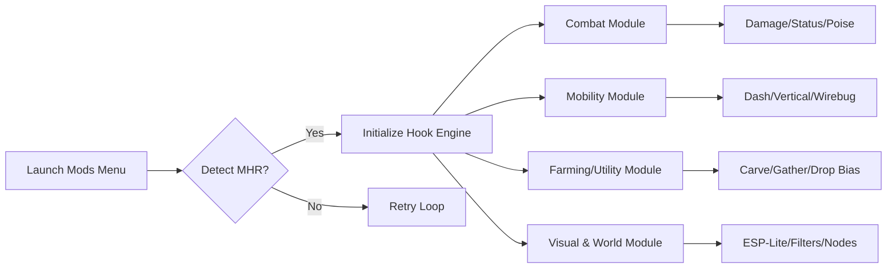

## Overview 🐉

The MONSTER HUNTER RISE Mods Menu Customization Engine provides a unified interface for tuning combat, movement, resource flow, companion behavior, visuals, and farming—all without overwhelming the player. Think of it as sculpting the cadence of your hunts rather than breaking them.

[!NOTE]
Every module is independent. Use only what complements your style.

---

## Features Overview 🌋

### **Combat Customization**

* **Damage Curve Editor** – Create multipliers for normal, enraged, and exhausted monster phases.
* **Weapon Art Freedom** – No cooldown for switch skills and silkbind moves.
* **Status/Element Amplifier** – Boost elemental effects or blight buildup.
* **Poise/Flinch Sculptor** – Control how hard monsters stagger—or how resilient they feel.

### **Mobility & Traversal Mods**

* **Dash Momentum Tuner** – Adjust sprinting and evasion flow.
* **Vertical Mobility Boost** – Subtle height gain for jumps and wall runs.
* **Wirebug Enhancer** – Faster recharge, extended distance, and cleaner aerial control.
* **Wirefall Recovery Mod** – More responsive recovery after being knocked down.

### **Survivability & Resource Flow**

* **Health Anchor** – Maintain HP above a set threshold.
* **Stamina Zone Control** – Reduce or regenerate stamina values.
* **Sharpness Freeze** – Lock your weapon at a desired sharpness tier.
* **Pet/Palico Companion Boost** – Optional buff stack for support units.

### **Farming & Automation Tools**

* **Auto-Carve Shortcut** – Ultra-fast carving with animation trim.
* **Gather Multiplier** – Increase harvest amounts without flooding loot tables.
* **Rare-Drop Bias** – Slight, configurable probability bonus for higher-tier materials.
* **Buddy Farm Accelerator** – Customizable boosts for resource generators.

### **World & Visual Layers (ESP-Lite+)**

* **Monster Weakpoint Highlights** – Color-coded vulnerability points.
* **Off-Screen Arrows** – Identify monster direction at all times.
* **Distance HUD** – Shows exact meters to each large monster.
* **Material Node Glow** – Visible crafting-node markers across the terrain.
* **Cinematic Filters** – Warm, neon, desaturated, or high-contrast palettes.

---


---

## Setup ⚡

1. Extract the Mods Menu package into its own folder.
2. Launch *Monster Hunter Rise* in borderless or windowed mode.
3. Start the Mods Menu executable with admin rights.
4. Select `MonsterHunterRise.exe` from the active process list.
5. Enable/disable modules individually or load a preset.

Quick example:

```bash
mhr-modmenu.exe -p MonsterHunterRise.exe -dx11hook -profile hunter
```

[!WARNING]
To prevent hook conflicts, close unnecessary screen overlays and recorders.

---

## System Diagram (Mermaid)



---

## Example Mod Presets 🐾

### **Wyvern Warlord** – Pure power & aggression

* Damage Curve: +40%
* Wirebug Recharge: Fast
* Stamina Regen: Enabled
* Weakpoint Highlights: On
* Gather Multiplier: Default

### **Hunter’s Ease** – Relaxed exploration mode

* HP Anchor: 75%
* Movement Boost: Low
* Sharpness Freeze: Blue tier
* Buddy Farm Accelerator: Mild
* Off-Screen Arrows: Enabled

### **Collector’s Cartographer** – Exploration & farming

* Gather Multiplier: ×2
* Rare Drop Bias: +10%
* Resource Nodes Glow: On
* Wirefall Recovery: High
* Damage Mods: Off

---

## Sample Configuration Snippet

```ini
[COMBAT]
damage_mult=1.45
status_amp=1.30
switchskill_reset=true
poise_scalar=0.70

[MOBILITY]
dash_boost=1.20
vertical_mobility=true
wirebug_recharge=fast

[RESOURCES]
hp_anchor=0.65
sharpness_freeze=green
stamina_regen=true

[FARMING]
gather_mult=2
drop_bias=0.10
auto_carve=true
buddy_farm=boosted

[VISUAL]
weakpoint_glow=true
node_glow=true
offscreen_arrows=true
filter=neon
```

---

## Technical Notes

* Polling Rate: 80–150 ms depending on module density.
* DX11 overlay ensures stable performance.
* Configuration autosaves on exit.
* Offset scanner ensures safe activation after updates.

[!IMPORTANT]
After major patches, always allow the safe-scanner to complete before enabling combat edits.

---

## FAQ

### Will mods work during cutscenes?

All visual and combat modules suspend during cinematics.

### Can I activate only farming mods?

Yes—modules are fully independent.

### Will this reduce FPS?

Only if many world/ESP layers run at high refresh rates simultaneously.

### Are presets easy to share?

Yes—presets are `.ini` based and plug-and-play.

### Does ultrawide work?

Perfect scaling for 21:9 and 32:9.

---

## Final Thoughts

The world of *Monster Hunter Rise* is a living tapestry—storms of claws and scales woven with quiet forests and sacred peaks. This Mods Menu doesn’t tear that tapestry; it lets you embroider it. Sharper fights, smoother movement, richer harvests—your path is yours to shape.
